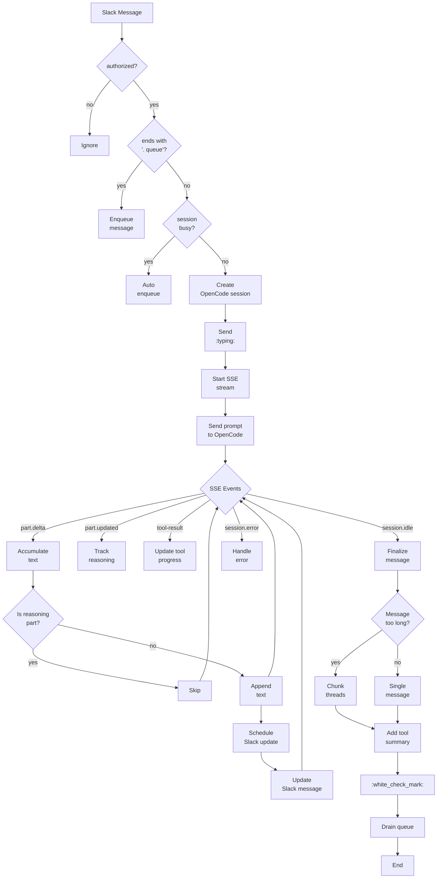

# OpenCode Slack Bridge - Technical Documentation

**Version:** 1.0.0  
**Branch:** `main`  
**Last Updated:** 2026-04-10  
**Status:** Production

---

## 1. Architecture Overview

```
┌─────────────────────────────────────────────────────────────────────────────────┐
│                        OPENCODE SLACK BRIDGE                             │
├─────────────────────────────────────────────────────────────────────────────────┤
│                                                                          │
│  ┌──────────────────┐         ┌──────────────────────────────────────────┐ │
│  │     Slack        │         │           Bridge Service                     │ │
│  │   Workspace     │────────▶│  (@slack/bolt Socket Mode)                │ │
│  │                  │         │                                          │ │
│  │  • DM messages   │         │  1. Receive message (message handler)     │ │
│  │  • @mentions     │         │  2. Map channel → session (SessionManager) │ │
│  │  • Thread replies│         │  3. Create/manage OpenCode session       │ │
│  │                  │         │  4. Stream SSE → Slack updates           │ │
│  │                  │◀────────│  5. Format and post to Slack           │ │
│  └──────────────────┘         └───────────────────┬───────────────────┘ │
│                                                   │                     │
│  ┌─────────────────────────┐                    ▼                     │
│  │    Message Queue         │         ┌────────────────────────┐         │
│  │  (per session, FIFO)     │────────▶│   OpenCode Server     │         │
│  │  • Enqueue when busy     │         │  (localhost:4096/4097)│         │
│  │  • Drain on idle        │         └────────────────────────┘         │
│  └─────────────────────────┘                       │                  │
│                                                   │                  │
│  ┌─────────────────────────┐                       ▼                  │
│  │   Session Database      │         ┌────────────────────────┐         │
│  │   (SQLite + WAL mode)   │◀───────▶│   SSE Event Bus        │         │
│  │  • channel_sessions    │         │  • message.part.delta │         │
│  │  • channel_directories │         │  • session.status    │         │
│  └─────────────────────────┘         │  • tool-result       │         │
│                                     │  • (filtered: thinking)         │
│                                     └────────────────────────┘         │
└─────────────────────────────────────────────────────────────────────────────────┘
```

### System Components

| Component | Location | Purpose |
|-----------|----------|---------|
| Entry | `src/index.ts` | Main entry, port detection |
| Slack Handler | `src/slack.ts` | Message + slash command handlers |
| OpenCode Client | `src/opencode.ts` | SDK wrapper, SSE subscriber |
| Stream Manager | `src/streaming.ts` | SSE→Slack, thinking filter |
| Session Manager | `src/sessions.ts` | Session lifecycle |
| Database | `src/database.ts` | SQLite persistence |
| Message Queue | `src/queue.ts` | Queued messages |
| Port Detector | `src/detect-port.ts` | Dynamic port detection |
| Setup Check | `src/setup.ts` | Environment verification |

---

## 2. Complete Flow Diagram



---

## 3. Component Details

### 3.1 Entry - `src/index.ts`

| Property | Value |
|----------|-------|
| **File** | `src/index.ts` |
| **Purpose** | Main entry, initializes bridge |
| **Key Functions** | `main()` |
| **Flow** | `detectOpenCodePort()` → `SlackBridge()` → `bridge.start()` |
| **Port Detection** | Uses `detect-port.ts` to auto-find OpenCode server |

**Startup Flow:**
```
index.ts:main()
    │
    ├── detectOpenCodePort()
    │   └── Scan ports [4097, 4096] → HTTP GET /global/health
    │       └─ Return baseUrl (e.g., http://localhost:4097)
    │
    ├── Create SlackBridge(config)
    │   └─ Initializes: App, Client, SessionManager, Queue, StreamManager
    │
    └── bridge.start()
        └─ App.start() + health check
```

### 3.2 Slack Handler - `src/slack.ts`

| Property | Value |
|----------|-------|
| **File** | `src/slack.ts` |
| **Purpose** | All Slack event and command handling |
| **Class** | `SlackBridge` |
| **Key Functions** | `setupHandlers()`, `setupCommands()` |
| **Events** | `message()` callback |
| **Commands** | `/abort`, `/resume`, `/queue`, `/sessions`, `/help` |

**Message Handling:**
```
1. Receive message (text or files)
2. Check authorization (user + channel allowlist)
3. Add typing reaction
4. Handle ". queue" suffix → enqueue
5. Validate input (max 10,000 chars)
6. Check if session busy → auto-enqueue
7. Create session if needed
8. Send ":typing:" in thread
9. Start stream manager
10. Send prompt to OpenCode
11. OpenCode streams responses via SSE
12. StreamManager updates Slack message
```

### 3.3 OpenCode Client - `src/opencode.ts`

| Property | Value |
|----------|-------|
| **File** | `src/opencode.ts` |
| **Purpose** | OpenCode SDK wrapper, SSE event bus |
| **Class** | `OpenCodeClient` |
| **Key Functions** | `createSession()`, `sendPrompt()`, `onSessionEvent()`, `listSessions()` |
| **SDK** | `@opencode-ai/sdk` |

**SSE Subscribe Pattern:**
```
1. client.event.subscribe() → AsyncIterable<Event>
2. For each event, emit to session-specific handlers
3. Event types: message.part.delta, message.part.updated, session.status, tool-*, etc.
```

### 3.4 Stream Manager - `src/streaming.ts`

| Property | Value |
|----------|-------|
| **File** | `src/streaming.ts` |
| **Purpose** | Event handling, thinking filter, Slack formatting |
| **Class** | `StreamManager` |
| **Key Functions** | `startStream()`, `handleEvent()`, `handleDelta()`, `handlePartUpdated()` |
| **Thinking Filter** | Event-level (not regex) |

**Thinking Filter (Event-Level):**
```
1. message.part.updated event received
2. Check part.type === 'reasoning'
3. If yes: add part.id to reasoningPartIds Set
4. On message.part.delta: check if partID in reasoningPartIds
5. If yes: SKIP (don't accumulate)
```

**Why Event-Level?**
- Regex fails when model doesn't use `<thinking>` tags
- Event-level is more reliable - tracks at source
- Works for ANY model (MiniMax, Qwen, etc.)

### 3.5 Session Manager - `src/sessions.ts`

| Property | Value |
|----------|-------|
| **File** | `src/sessions.ts` |
| **Purpose** | Session lifecycle management |
| **Class** | `SessionManager` |
| **Storage** | SQLite via `SessionDatabase` |

**Session Mapping:**
- Key: `channelId` or `channelId:threadTs`
- Value: OpenCode session ID
- Persistence: Survives restarts

### 3.6 Database - `src/database.ts`

| Property | Value |
|----------|-------|
| **File** | `src/database.ts` |
| **Purpose** | SQLite persistence (better-sqlite3) |
| **Class** | `SessionDatabase` |
| **Mode** | WAL (better concurrent reads) |

**Schema:**
```sql
CREATE TABLE channel_sessions (
  channel_id TEXT PRIMARY KEY,
  session_id TEXT NOT NULL,
  created_at DATETIME DEFAULT CURRENT_TIMESTAMP,
  updated_at DATETIME DEFAULT CURRENT_TIMESTAMP
);

CREATE TABLE channel_directories (
  channel_id TEXT PRIMARY KEY,
  directory TEXT NOT NULL,
  created_at DATETIME DEFAULT CURRENT_TIMESTAMP
);
```

### 3.7 Message Queue - `src/queue.ts`

| Property | Value |
|----------|-------|
| **File** | `src/queue.ts` |
| **Purpose** | FIFO queue for busy sessions |
| **Class** | `MessageQueue` |
| **Max Size** | 100 messages per session |

**Queue Flow:**
```
1. Message arrives while session busy
2. .queue suffix or auto-enqueue
3. Enqueue with max size 100
4. When session.idle: drainQueue()
5. Process next message FIFO
```

### 3.8 Port Detector - `src/detect-port.ts`

| Property | Value |
|----------|-------|
| **File** | `src/detect-port.ts` |
| **Purpose** | Auto-detect OpenCode server port |
| **Function** | `detectOpenCodePort()` |
| **Strategy** | Health check on common ports |

**Discovery:**
```
Ports: [4097, 4096]
For each port:
  1. HTTP GET /global/health
  2. If 200 OK → return URL
  3. If all fail → spawn new OpenCode on 4097
```

**Problem Solved:**
- OpenCode v1.3+ changed behavior: HTTP server disabled by default
- May start on random port (4096, 5000, 6000, 61108, etc.)
- Port 4096 shows LISTEN but can't HTTP connect (CloseWait)

---

## 4. Decision Log

| Date | Decision | Rationale |
|------|----------|-----------|
| 2026-04-01 | Use event-level thinking filter | MiniMax doesn't use `<thinking>` tags, regex fails |
| 2026-04-01 | Dynamic port detection | OpenCode v1.3+ HTTP server disabled by default |
| 2026-04-02 | Message chunking (>11K chars) | Slack message limits: 4,000 (text), 12,000 (mrkdwn), 2,000-3,000 (blocks) |
| 2026-04-02 | Slack Block Kit formatting | Better than plain text - auto-translates markdown |
| 2026-04-03 | Enable DEBUG by default in run.bat | User troubleshooting needed |
| 2026-04-03 | Fix cursor bug | Check object type before accessing nested text |
| 2026-04-10 | Add 2-minute tool timeout | Auto-abort stuck tools, notify user in Slack |

---

## 5. Slack Message Limits

| Field | Limit | Bridge Uses |
|-------|-------|-------------|
| `text` | 4,000 chars | Fallback (first 150) |
| `mrkdwn` | 12,000 chars | Per block |
| Per block | 2,000-3,000 chars | `markdown` block |
| Message thread | 10 replies max | Chunked messages |

**Chunking Strategy:**
```
Max per chunk: 11,000 chars (safety margin)
Chunk markers: [1/3], [2/3], [3/3]
Thread: Replies in thread of original message
Tool summary: Only on final chunk
```

---

## 6. Security Model

### Access Control

| Setting | Default | Description |
|---------|---------|-------------|
| `ALLOWED_USERS` | All | User IDs (comma-separated) |
| `ALLOWED_CHANNELS` | All | Channel IDs (comma-separated) |

### Agent Permissions

| Permission | Value |
|------------|-------|
| `read` | ✅ Yes |
| `bash` | ✅ Yes |
| `write` | ❌ No |
| `edit` | ❌ No |

> Agent only has read + bash permissions for safety when running via Slack.

---

## 7. Debug Mode

| Environment | Value |
|-------------|-------|
| `DEBUG` | `true` or `false` (default: true in run.bat) |

**What DEBUG Shows:**
- All SSE events (type, properties)
- Session status changes
- Reasoning part tracking
- Tool start/complete
- Queue operations

**Enable:**
```bash
# Via environment
DEBUG=true npm run dev

# Or use run.bat (default)
run.bat
```

---

## 8. API Reference

### OpenCode Client Methods

| Method | Purpose |
|--------|---------|
| `checkHealth()` | Health check |
| `createSession()` | Create new session |
| `sendPrompt(sessionId, prompt, agent)` | Send message |
| `onSessionEvent(sessionId, handler)` | Subscribe to SSE |
| `listSessions()` | List recent sessions |
| `abortSession(sessionId)` | Stop session |

### Slack Bridge Slash Commands

| Command | Description |
|---------|-------------|
| `/abort` | Stop current session |
| `/resume [n]` | Resume previous session (show list if no arg) |
| `/queue` | View queue status |
| `/queue clear` | Clear all queued messages |
| `/sessions` | Show current session info |
| `/help` | Show help |

---

## 9. File Structure

```
opencode-slack-bridge/
├── src/
│   ├── index.ts           # Entry point
│   ├── slack.ts          # Slack handlers
│   ├── opencode.ts       # OpenCode client
│   ├── sessions.ts      # Session management
│   ├── database.ts     # SQLite
│   ├── streaming.ts    # SSE handling + thinking filter
│   ├── queue.ts        # Message queue
│   ├── formatting.ts   # Slack formatting utilities
│   ├── detect-port.ts  # Dynamic port detection
│   └── setup.ts        # Environment check
├── data/                # SQLite database (gitignored)
├── docs/
│   └── TECHNICAL.md    # This file
├── .env.example        # Token template
├── .gitignore
├── run.bat             # Windows launcher
├── SETUP.md            # Slack app setup guide
├── README.md           # User documentation (overview)
├── package.json
└── tsconfig.json
```

---

## 10. Testing

### Manual Testing

| Test | Command | Expected |
|------|---------|----------|
| Start bridge | `npm run dev` | "⚡️ OpenCode Slack Bridge is running!" |
| Send DM | @bot "Hello" | ":typing:" response |
| Chunking | Send long prompt | Threaded messages with [1/N] |
| Thinking filter | Use MiniMax | No reasoning in output |
| Queue | While busy, send another | Auto-queued, processed in order |
| Abort | `/abort` | Session stopped |

### Debug Verification

```bash
# Enable debug
DEBUG=true npm run dev

# Should see:
# [2026-04-10T12:00:00] [ses_123abc] EVENT: message.part.delta ...
# [2026-04-10T12:00:00] [ses_123abc] 🔄 PART UPDATED: ...
# [2026-04-10T12:00:00] [ses_123abc] 📊 SESSION STATUS: ...
```

---

## 11. Known Issues

### Resolved

- ~~Port detection fails on random ports~~ → Health check scan implemented
- ~~Thinking/reasoning shows in output~~ → Event-level filtering implemented
- ~~Long messages fail~~ → Chunking implemented
- ~~Cursor symbol crashes~~ → Object type check before access

### Debugging Tips

| Symptom | Check |
|---------|-------|
| Bot not responding | Socket Mode enabled? |
| "missing_scope" | OAuth scopes added? |
| No messages | Event subscriptions? |
| Thinking shows | DEBUG=true, check for reasoningPartIds |
| Port issues | `curl localhost:4096/global/health` |

---

## 12. Future Roadmap

### Priority 1 (Next Sprint)

- [ ] Add multi-project support (channel→directory mapping)
- [ ] Add session export/import
- [ ] Add webhook for external triggers

### Priority 2 (Backlog)

- [ ] Add persistent context (system prompt)
- [ ] Add file upload support
- [ ] Add voice/image responses

### Priority 3 (Ideas)

- [ ] Add conversation summaries
- [ ] Add code execution sandbox
- [ ] Add custom agent prompts

---

## Appendix A: Environment Variables

| Variable | Required | Description |
|----------|---------|-------------|
| `SLACK_APP_TOKEN` | Yes | Socket Mode token (xapp-...) |
| `SLACK_BOT_TOKEN` | Yes | Bot token (xoxb-...) |
| `OPENCODE_URL` | No | OpenCode server URL (default: http://localhost:4096) |
| `OPENCODE_AGENT` | No | Agent name (default: slack-agent) |
| `ALLOWED_USERS` | No | Comma-separated user IDs |
| `ALLOWED_CHANNELS` | No | Comma-separated channel IDs |
| `DEBUG` | No | Enable debug logging |

---

## Appendix B: Package Dependencies

| Package | Version | Purpose |
|---------|---------|---------|
| `@slack/bolt` | ^4.x | Slack SDK (Socket Mode) |
| `@opencode-ai/sdk` | latest | OpenCode SDK |
| `@slack/web-api` | ^7.x | Slack Web API |
| `better-sqlite3` | ^11.x | SQLite |
| `dotenv` | ^16.x | Environment config |
| `ws` | ^8.x | WebSocket (dependency) |

---

*End of Technical Documentation*